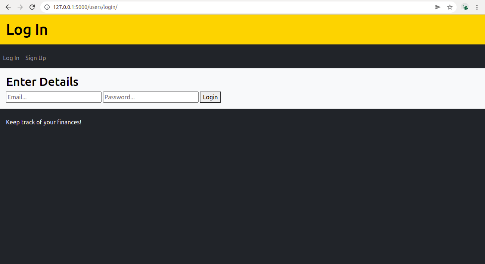

# Financial Tracker

## Overview

This application is a web-based financial tracker. The users can manage their income and expenses through the application to track their financials and make better decisions. 

Users are able to perform the following:
- sign-up.
- login/logout.
- edit profile and add/update address.
- manage income/expense transactions (create, view, update, delete).
- add/remove multiple supporting images for each transaction.
- view total balance and list of all transactions ordered by date.

 

## Requirements

You need the following:
- Python3 must be installed.
- PostgreSQL database created and accessible.

 

## Installation steps

    1- Copy ".env.dist" to ".env" file.
    2- Make sure you have a PostgreSQL database created with a user that has full access to it.
    3- Set the database name, user and password in ".env" file.
    4- Create a S3 bucket on AWS and create an IAM user that has programatic access to this bucket with permissions to read, write and delete objects from the bucket.
    5- Set the bucket name and credentials in ".env" file.
    6- run the script "install.sh" which will install dependencies and setup the web servers.
    7- run the script "create_database.sh" which will create the database tables and initialize the needed data.

 

## Pages and functionalities

 

### Log In page

When users first enter the website, they will be redirected to the login page where they can use their email and password to login or, in case they haven't signed-up before, they can click on the "Sign Up" link in the menu.

 

### Sign Up page

Users can sign up with their email addresses as long as the email they provide is not used by another account. After the signup details are provided and submitted, the application will create the account, login the user and redirect them to the main page (Transaction Index).

Field validations:
- Name must be provided and should have a minimum length of 1 character.
- Email must be provided and should be of a valid email format.
- Password must be provided and should be at least 6 characters long.

 

### Transaction Index page

After signup/login the users are redirected to the transaction index page. Here users can create new transactions which can be either debit or credit transactions.

Field validations:
- Name must be provided and should have a minimum length of 1 character.
- Amount must be provided and the HTML form input of type "number" will make sure the users only enter numbers, which makes it less likely for them to enter invalid values. It can also be either negative (for credit) or positive (for debit).
- Date must be provided and the HTML form input of type "date" will make sure the users only enter dates, which makes it less likely for them to enter invalid values and much easier to use.

The transaction index page also shows the total balance of the user at the top, in addition to a list of transactions the user has created which are listed at the bottom ordered by the date in ascending order.

 

### Transaction Detail page

After creating a transaction, or after clicking on its link in the list, users will be redirected to the transaction detail page. Here they can view/update the details of the transaction, in addition to the ability to add/remove multiple image files that act as proof or as supporting documents for the transaction. The images are stored on an AWS S3 bucket and their names/paths are saved in the database. This page also provides users with the option to delete the transaction, which under the hood also deletes the images from the S3 bucket and their details from the database.

Field validations:
- Name must be provided and should have a minimum length of 1 character.
- Amount must be provided and the HTML form input of type "number" will make sure the users only enter numbers, which makes it less likely for them to enter invalid values. It can also be either negative (for credit) or positive (for debit).
- Date must be provided and the HTML form input of type "date" will make sure the users only enter dates, which makes it less likely for them to enter invalid values and much easier to use.

 

### Account Details page

When pressing the "Account" link in the menu, users will be redirected to the account details page. Here users can view/update their name and email, in addition to the address details. The address details are initially empty, but once the user updates them an address will be created for the user and saved to the database. In addition, the address details section includes a drop down containing the list of all countries which can be managed from the database by setting certain countries as active/inactive.

Field validations for account details:
- Name must be provided and should have a minimum length of 1 character.
- Email must be provided and should be of a valid email format. The email should also be unique, where a user cannot update the email to something that is used by a different account.

Field validations for address details:
- Street name must be provided and should have a minimum length of 1 character.
- Suburb name must be provided and should have a minimum length of 1 character.
- State name must be provided and should have a minimum length of 1 character.
- Country must be provided and the HTML form input of type "select" will make it much easier for users to enter the correct value for the country they intend.

 

## Entity relationship diagram

 

## Application security

- Authentication: The application uses the "flask-login" package to perform user authentication. Users are required to login with an email and password in order to be able to use the features of the website. The authentication is based on JWT cookies which are encrypted by the server so that only the server can decrypt and read the contents of the cookies. Passwords are not saved as plain text in the database, instead they are hashed and hashing is performed everytime a user passes their credentials to compare with the saved hash. 

- Authorization: Financial data is very sensitive and privacy is a major concern. Authentication alone is not enough and the application strictly manages who can access a certain resource. Every single endpoint, that requires users to login, checks if the accessed resource belongs to the logged-in user and blocks access otherwise.

- Privacy regarding images: First of all the images that users attach to transactions are saved to the cloud with random names following the "UUID version 4" format. In addition, even though the images are accessed through web links returned in the HTML pages, the links are not permanent. Every time an image needs to be displayed to a user the application will securely communicate with the cloud platform to create a short-lived link to the image that expires after a certain time. This way the application can guarantee that no one can try brute-forcing names/links to access the images.

- Preventing SQL injection: The application relies on the "SQLAlchemy" ORM package to perform requests to the database. The biggest importance of using an ORM is that the database requests are sanitized to prevent possible SQL injection attacks.

 

## Professional, ethical and legal obligations

The deployment and the ongoing support of the financial tracker website is subject to professional, legal and ethical obligations. Some customers may solely depend on the use of the financial tracker website to keep track of all their expenses and receipts, some of which they may need for tax purposes. Therefore, the owners of the financial tracker website have a professional obligation to act with due care and skill which is also enforceable by the Australian Consumer Law (Consumer Affairs Australia). The technology stack used in the website must be reliable and updated to maintain the highest professional standards in running a functional website. Customers must be warned if any services they depend on will no longer be available so that they can migrate important information such as proof of transactions they need for taxation purposes. Moreover, the information of customers should be handled carefully with the right security measures taken and trustable, reliable cloud providers used to prevent the leak of users’ information to unwanted sources (hackers or enemy states). The financial tracker website is bound by The Privacy Act 1988 which is in place to ensure the protection of customers' personal information. The information of customers must not be abused for marketing purposes and users must be notified and asked for consent for their information to be used for marketing and market research.
